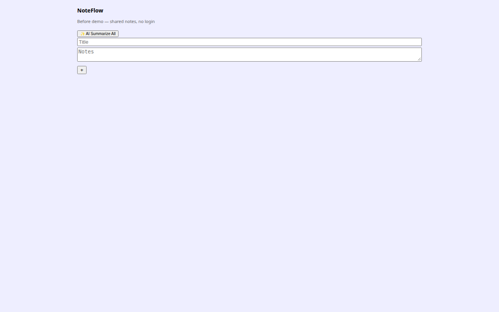
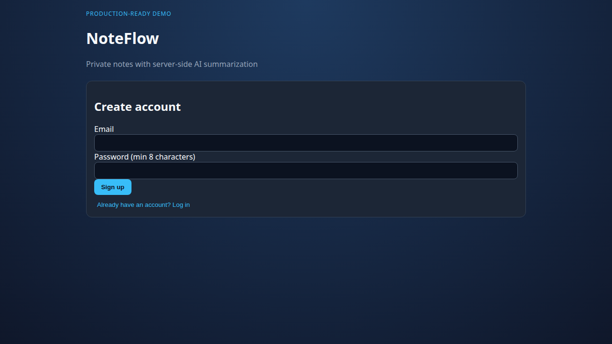
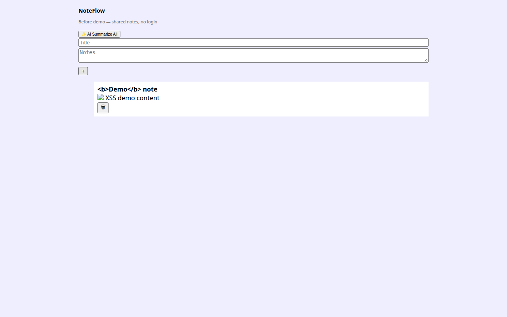
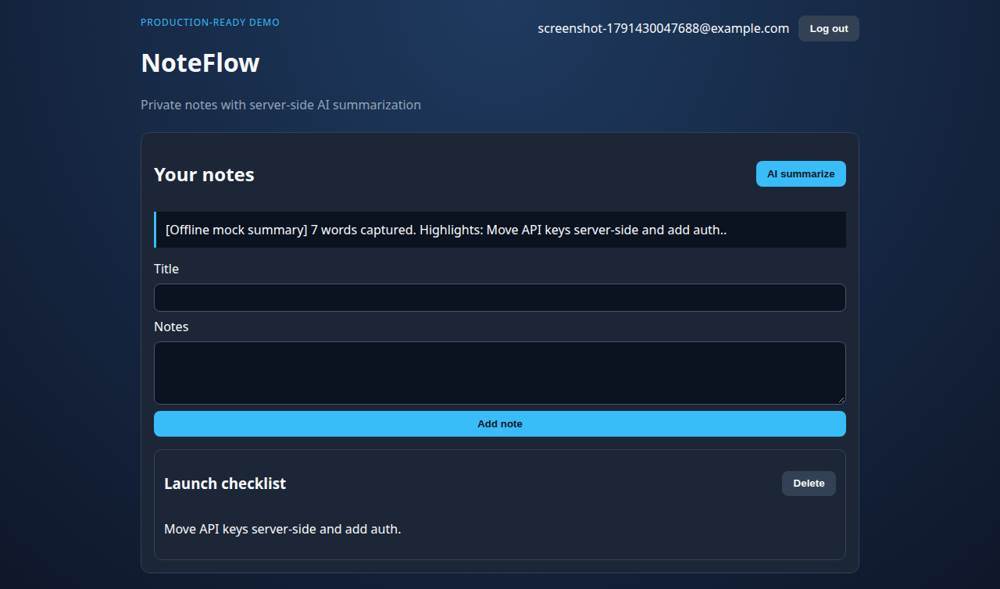
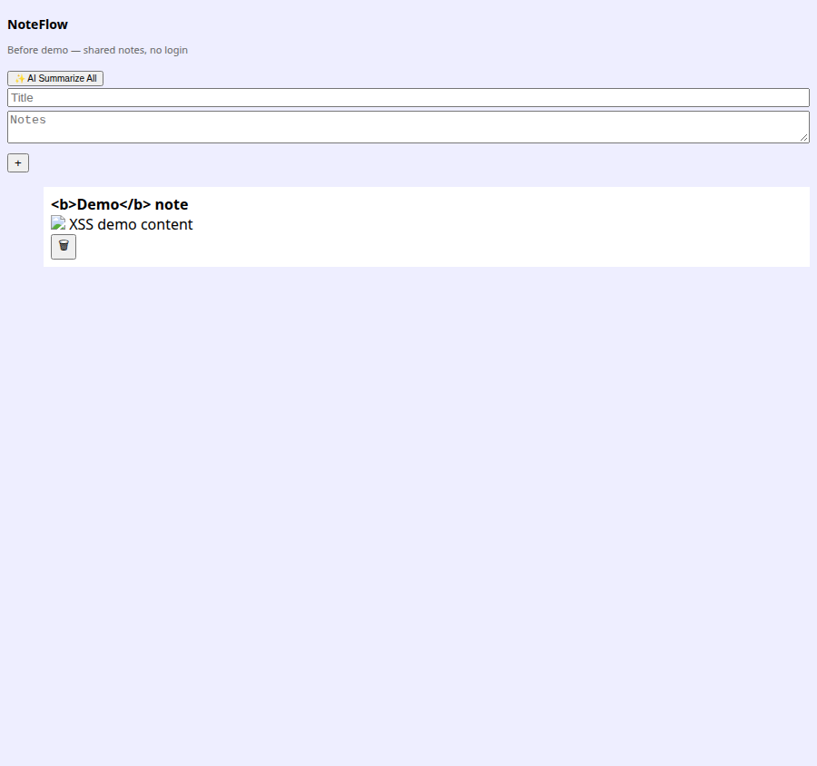
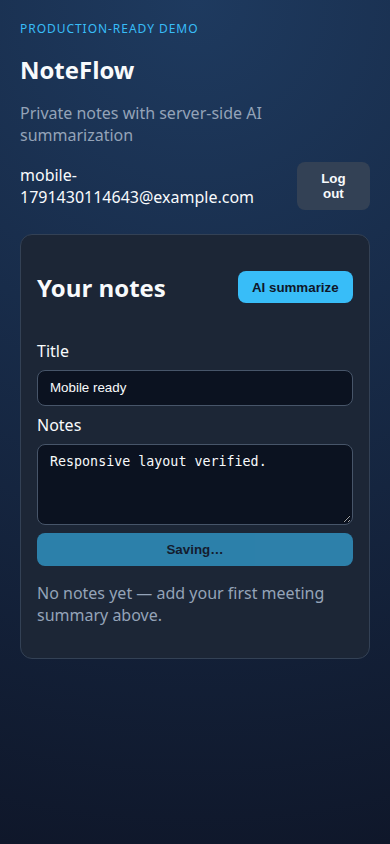
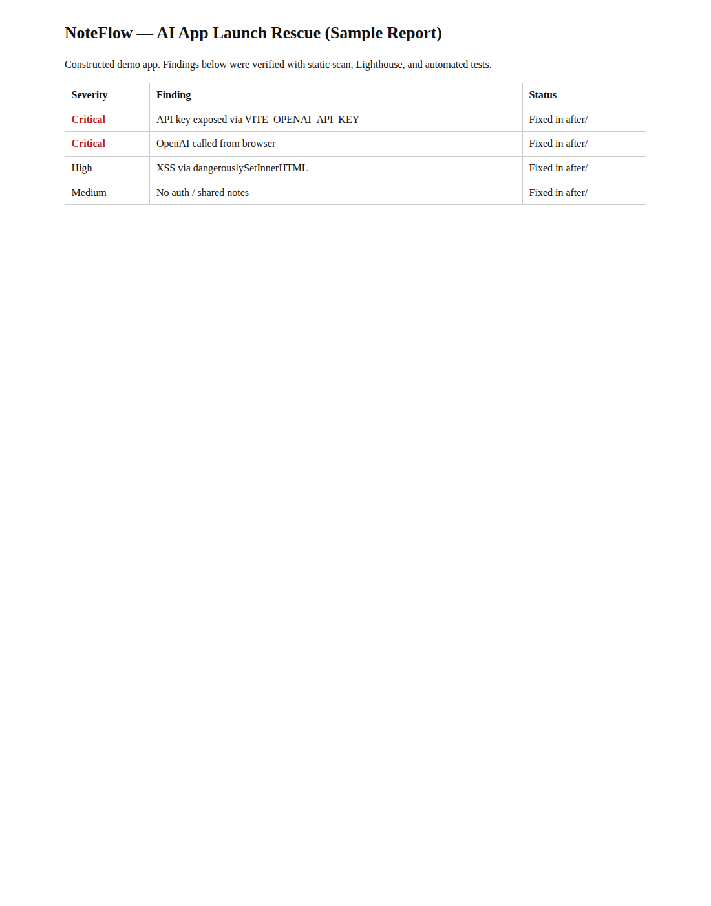

# AI App Launch Rescue — Portfolio Case Study

**Constructed demo (not a real client).** This repository showcases the Upwork service:

> *I take your half-finished AI-built app (Lovable / Bolt / v0 style) and make it production-ready and deployed.*

**NoteFlow** is a small meeting-notes SaaS with an AI summarize feature. The **`before/`** folder is intentionally vulnerable and rough, like many AI-generated prototypes. The **`after/`** folder is the same product hardened for real users.

Full findings and measured results: **[REPORT.md](./REPORT.md)**

---

## The client problem

Non-technical founders often ship prototypes with:

- API keys in the frontend bundle  
- No login or per-user data isolation  
- Missing validation and error handling  
- XSS-prone rendering  
- AI endpoints without rate limits  
- Failing or untested builds  
- Weak mobile layout and accessibility  

This repo shows what an audit + rescue pass looks like on a realistic codebase.

---

## Before / after screenshots

| Before (prototype) | After (production-ready) |
|--------------------|---------------------------|
|  |  |
|  |  |
|  |  |

Sample client report preview:



---

## Run locally (~2 minutes)

**Requirements:** Node.js 22+, npm

### Before (vulnerable demo)

```bash
cd before
npm install
npm run dev
```

Open **http://127.0.0.1:5173** (API on port **3001**). No API key required — AI uses offline mock fallback.

### After (hardened demo)

```bash
cd after
npm install
cp .env.example .env   # optional: set OPENAI_API_KEY for live LLM
npm run dev
```

Open **http://127.0.0.1:5174** (API on port **3002**). Register a user, add notes, run **AI summarize**.

### Tests (after only)

```bash
cd after
npm run test          # unit tests
npm run test:e2e      # Playwright (installs Chromium on first run)
npm run lint && npm run typecheck && npm run build
```

### Static issue scanner

```bash
npm install   # repo root — installs Playwright for screenshot scripts
node scripts/health-scan.mjs before
node scripts/health-scan.mjs after
```

---

## Deploy to Vercel (free tier)

Do **not** deploy `before/` to production with real secrets — it is a teaching baseline.

### After app (recommended)

1. Import repo in Vercel.  
2. Set **Root Directory** to `after`.  
3. Environment variables: `JWT_SECRET` (required), `OPENAI_API_KEY` (optional — mock used if empty).  
4. Deploy. API routes are served from `after/api/index.ts`; demo DB is in-memory on Vercel.

### Before app (optional side-by-side demo)

1. Root Directory: `before`.  
2. Build command: `npm run vercel-build`.  
3. No secrets needed for mock AI.

---

## What the rescue covers (this example)

| Area | Before | After |
|------|--------|-------|
| Secrets | `VITE_OPENAI_API_KEY` in client | Server-only `OPENAI_API_KEY` |
| Auth | None | JWT httpOnly cookie |
| Data | Global notes table | Per-user SQLite rows |
| Validation | None | Zod |
| AI | Client + unauthenticated API | Auth + rate limit + mock fallback |
| XSS | `dangerouslySetInnerHTML` | Escaped text |
| Tests / CI | None | Vitest + Playwright + GitHub Actions |

See **[before/ISSUES.md](./before/ISSUES.md)** for the full seeded list.

---

## How I’d work on your app

1. **Discovery call** — stack, deploy target, deadlines, and what “done” means.  
2. **Baseline audit** — run/build, automated scan, manual security review (report like [REPORT.md](./REPORT.md)).  
3. **Fix plan** — critical security first, then reliability and UX.  
4. **Implementation** — small PRs with tests; secrets and auth before features.  
5. **Verification** — CI green, Lighthouse spot-check, staging deploy.  
6. **Handoff** — report, env var checklist, and short Loom walkthrough if you want.

---

## Repository layout

```
before/          # vulnerable AI-prototype style app
after/           # production-ready version + tests
scripts/         # health-scan.mjs, Playwright screenshot helpers
docs/screenshots/
REPORT.md        # sample client deliverable
.github/workflows/ci.yml
```

---

## License

MIT — demo code for portfolio purposes.
